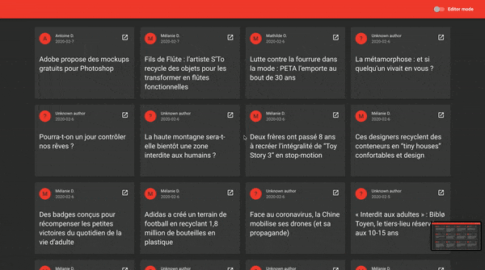

# JSON-blog
A client-server app that parses and stores JSON articles to then display them on a material UI interface.


## Setup

### Environment variables
Setup the following environment variables in a `.env` file at the root of the project.

| Env Variable | Description | Example |
|--------------|-------------|---------|
| `MONGO_HOST` | Mongodb database url | mongodb://127.0.0.1:27017/be-inspired |
| `MONGO_USER` | Mongodb user | user |
| `MONGO_PWD`  | Mongodb password | password |
| `NODE_ENV`   | Node environment (optional) | development |
| `PORT`       | Port to run the app on (optional) | 4000 |

#### Environment variables (for the client)
| Env Variable | Description | Example |
|--------------|-------------|---------|
| `REACT_API_HOST` | Host origin of the API (optional) | http://www.api.com |

### Installing
To install all the necessary dependencies :
```
cd server && npm install && cd client && npm install
```
To run the application in development mode, run concurrently those 2 commands :
```
npm start
cd client && npm start
```

## Deployment
```
cd client && npm run build
cd .. && npm start
```
## Deployment with Docker
```
docker-compose build
docker-compose up
```

## Built With

* [Node.JS](https://nodejs.org) - The backend framework used
* [ReactJS](https://reactjs.org) - The frontend framework used
* [Material UI](https://material-ui.com/) - The frontend styling library

## Authors

* **Yoppoy** - *Shiba lover* - [Cute shiba](https://www.instagram.com/marutaro/)

## License

This project is licensed under the MIT License - see the [LICENSE.md](LICENSE.md) file for details
